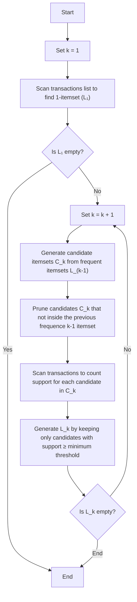
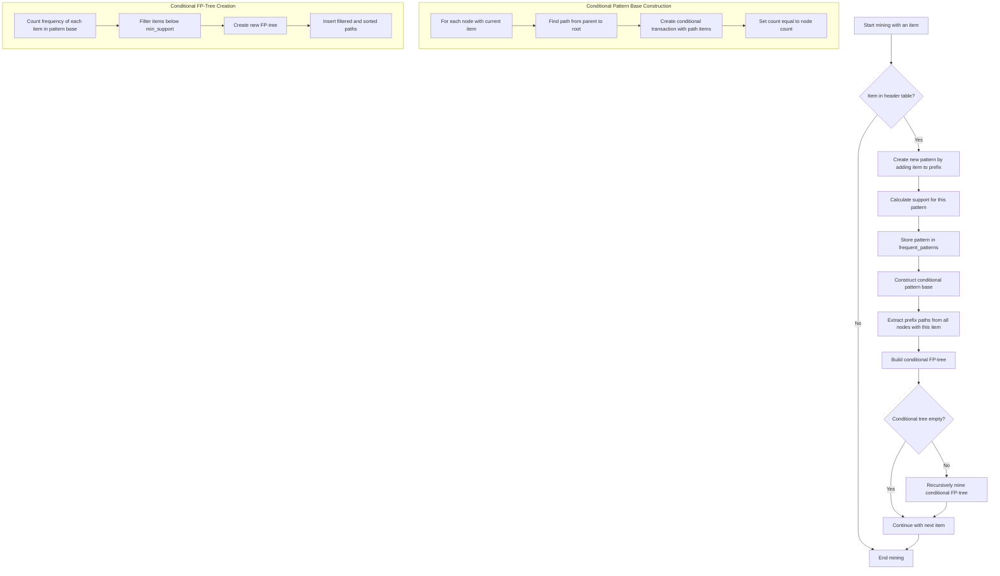

## Apiori algorithms Flow
<!-- <Flowchart> -->

```mermaid
flowchart TD
    A[Start] --> B["Set k = 1"]
    B --> C["Scan transactions list to find 1-itemset (L₁)"]
    C --> D{"Is L₁ empty?"}
    D -->|No| E["Set k = k + 1"]
    D -->|Yes| Z[End]
    E --> F["Generate candidate itemsets C_k from frequent itemsets L_(k-1)"]
    F --> G["Prune candidates C_k that not inside the previous frequence k-1 itemset"]
    G --> H["Scan transactions to count support for each candidate in C_k"]
    H --> I["Generate L_k by keeping only candidates with support ≥ minimum threshold"]
    I --> J{"Is L_k empty?"}
    J -->|No| E
    J -->|End| Z


```
## FP Growth 

```mermaid
flowchart TD
    A[Start mining with an item] --> B{Item in header table?}
    B -->|Yes| C[Create new pattern by adding item to prefix]
    C --> D[Calculate support for this pattern]
    D --> E[Store pattern in frequent_patterns]
    E --> F[Construct conditional pattern base]
    F --> G[Extract prefix paths from all nodes with this item]
    G --> H[Build conditional FP-tree]
    H --> I{Conditional tree empty?}
    I -->|No| J[Recursively mine conditional FP-tree]
    I -->|Yes| K[Continue with next item]
    J --> K
    B -->|No| L[End mining]
    K --> L
    
    subgraph "Conditional Pattern Base Construction"
    G1[For each node with current item] --> G2[Find path from parent to root]
    G2 --> G3[Create conditional transaction with path items]
    G3 --> G4[Set count equal to node count]
    end
    
    subgraph "Conditional FP-Tree Creation"
    H1[Count frequency of each item in pattern base] --> H2[Filter items below min_support]
    H2 --> H3[Create new FP-tree]
    H3 --> H4[Insert filtered and sorted paths]
    end
```
