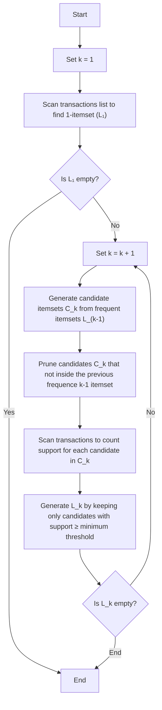

## Apiori algorithms Flow
<!-- <Flowchart> -->

```mermaid
flowchart TD
    A[Start] --> B["Set k = 1"]
    B --> C["Scan transactions list to find 1-itemset (L₁)"]
    C --> D{"Is L₁ empty?"}
    D -->|No| E["Set k = k + 1"]
    D -->|Yes| Z[End]
    E --> F["Generate candidate itemsets C_k from frequent itemsets L_(k-1)"]
    F --> G["Prune candidates C_k that not inside the previous frequence k-1 itemset"]
    G --> H["Scan transactions to count support for each candidate in C_k"]
    H --> I["Generate L_k by keeping only candidates with support ≥ minimum threshold"]
    I --> J{"Is L_k empty?"}
    J -->|No| E
    J -->|End| Z


```
